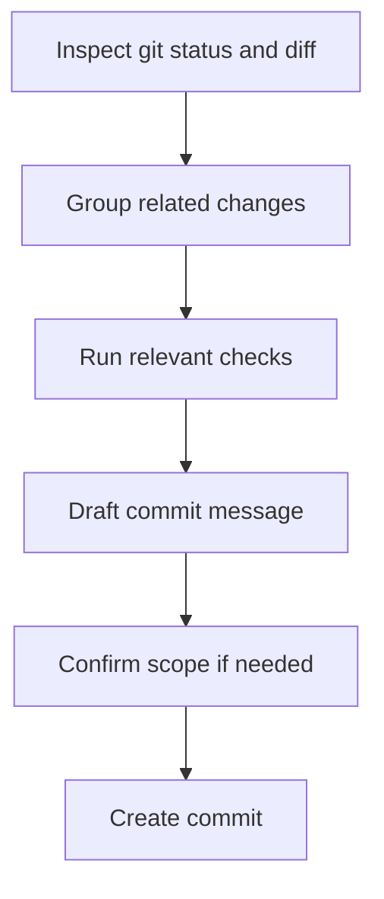

# Commit Changes Skill

**Purpose**: Help the agent turn local changes into safe, focused, well-described git commits.

## Input

Commit intent: `${ARGUMENTS}`

If the intent is empty, infer it from the diff and ask one short confirmation question before committing.

## Workflow



## Instructions

1. **Confirm permission**
   - Only create commits when the user explicitly asked for a commit or clearly delegated commit preparation.
   - Never amend, rebase, force-push, or create extra commits unless the user asked.

2. **Inspect the current state**
   - Review `git status --short` first.
   - Review the diff for all affected files.
   - If the changes obviously contain multiple unrelated concerns, propose splitting them into separate commits.

3. **Keep commits focused**
   - Prefer one logical change per commit.
   - Do not mix refactors, formatting, dependency updates, and feature work unless they are inseparable.
   - If partial staging is required, explain the split clearly before committing.

4. **Verify before committing**
   - Run the smallest relevant verification for the changed area.
   - If verification fails, fix the issue first or tell the user why the commit is not ready.
   - Do not commit known-broken changes unless the user explicitly asks for a checkpoint commit.

5. **Write a strong commit message**
   - Use conventional commit style when possible: `type(scope): summary`.
   - Keep the summary specific and outcome-focused.
   - Good types: `feat`, `fix`, `refactor`, `docs`, `test`, `chore`.
   - Add a short body only when extra context helps reviewers.

6. **Create the commit**
   - Stage only the intended files.
   - Create the commit.
   - After committing, report the commit title and any verification that was run.

## Commit Message Heuristics

- **feat**: new user-visible capability
- **fix**: bug fix or behavior correction
- **refactor**: internal cleanup without behavior change
- **docs**: documentation-only change
- **test**: tests added or updated
- **chore**: tooling, config, or housekeeping

## Output Template

```markdown
Proposed commit plan
- Scope: [what is included]
- Verification: [command or manual check]
- Commit message: `type(scope): summary`

Created commit
- Hash: [short hash]
- Message: `type(scope): summary`
- Verification: [what passed]
```

## Examples

### Example 1: Single focused change

Input: `commit the marketplace metadata update`

Output:
```markdown
Proposed commit plan
- Scope: update marketplace metadata version and description
- Verification: manual review of .claude-plugin/marketplace.json
- Commit message: `chore(marketplace): refresh plugin metadata`
```

### Example 2: Split mixed work

Input: `commit my changes`

Output:
```markdown
I found two unrelated changes in the diff:
1. skill documentation updates
2. hook script cleanup

Recommended commits:
- `docs(skills): add commit and PR workflow guidance`
- `refactor(hooks): simplify language context script`
```

## Guidelines

- Prefer clarity over clever wording.
- Mention the changed area in the scope when it helps.
- Avoid generic summaries like `update files` or `fix stuff`.
- If the repo already shows a clear commit style in recent history, follow that style.
