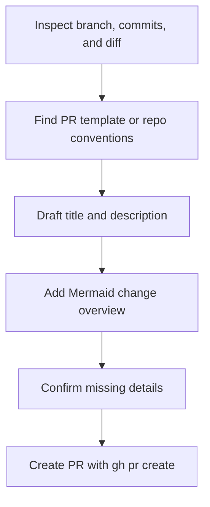
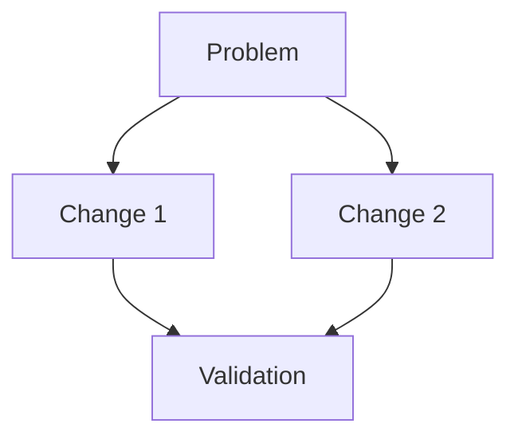
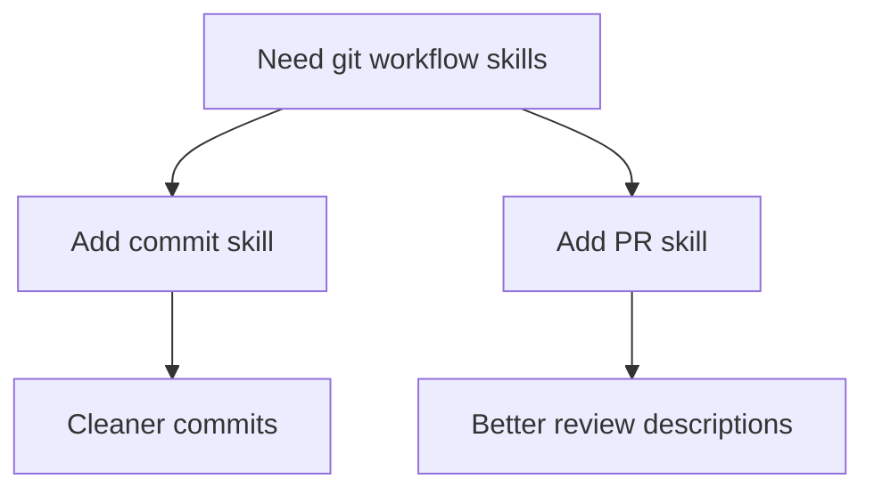

# Create PR Skill

**Purpose**: Help the agent create polished pull requests that are easy to review and easy to merge.

## Input

PR request: `${ARGUMENTS}`

If the request does not specify a base branch, use the repository default branch or ask the user when the target is ambiguous.

## Workflow



## Instructions

1. **Confirm PR readiness**
   - Make sure the branch has committed changes.
   - Check whether the branch has been pushed; if not, push it before creating the PR.
   - Review `git status`, commit history, and the diff against the base branch.

2. **Gather repository context**
   - Look for PR templates or contribution guidance and follow them.
   - Infer the main user-facing goal, implementation strategy, and verification steps from the diff.
   - If anything important is missing, ask a short clarifying question instead of guessing.

3. **Write a strong PR title**
   - Keep it short and outcome-focused.
   - Reuse conventional-commit style if the repo uses it.
   - Prefer the result over the implementation detail.

4. **Write a great PR description**
   - Lead with the problem and the outcome.
   - Summarize the most important changes in 3-5 bullets.
   - Include testing or validation notes.
   - Call out migrations, rollout concerns, screenshots, or follow-up work when relevant.
   - Always include a Mermaid diagram section to make the change easier to scan.

5. **Mermaid rules**
   - Use a simple `flowchart TD` or `graph TD` diagram.
   - Show the relationship between problem, main changes, and validation.
   - Keep labels short, readable, and stable.
   - Do not generate decorative diagrams that add no review value.

6. **Create the PR**
   - Build the final body in markdown.
   - Use `gh pr create` with the chosen base branch, title, and body.
   - After creation, report the PR title, base branch, and URL.

## PR Description Template

````markdown
## Summary
- [One sentence describing the outcome]

## What Changed
- [Change 1]
- [Change 2]
- [Change 3]

## Validation
- [test command or manual verification]

## Mermaid Overview


## Risks / Notes
- [optional rollout note, migration, or follow-up]
````

## Examples

### Example 1: Draft only

Input: `write a PR description for the new skills`

Output:
````markdown
## Summary
- Add reusable skills for committing changes and creating PRs.

## What Changed
- Add a `commit-changes` skill for focused conventional commits.
- Add a `create-pr` skill for structured PR authoring.
- Standardize both skills around verification-first workflows.

## Validation
- Reviewed new skill frontmatter and markdown structure manually.

## Mermaid Overview

````

### Example 2: Create the PR

Input: `create a PR into master`

Output:
```markdown
Created PR
- Title: `feat(skills): add commit and PR workflow skills`
- Base: `master`
- URL: [generated by gh]
```

## Guidelines

- Prefer reviewer readability over exhaustive detail.
- Do not invent test results, issue links, or screenshots.
- Keep the Mermaid diagram tightly aligned with the actual diff.
- If the repo has a PR template, merge these sections into that template instead of replacing it.
