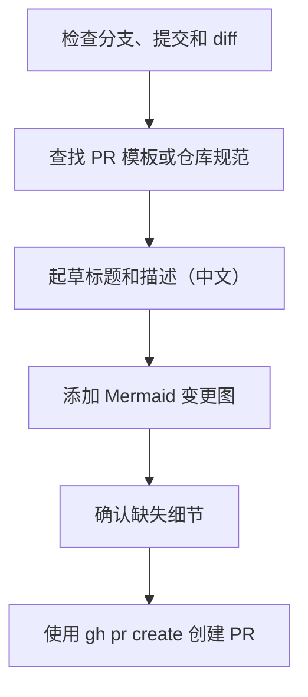
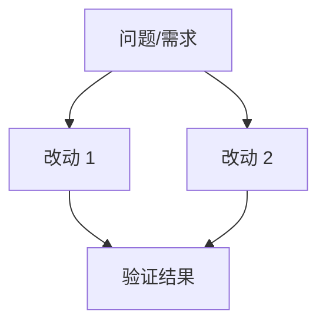
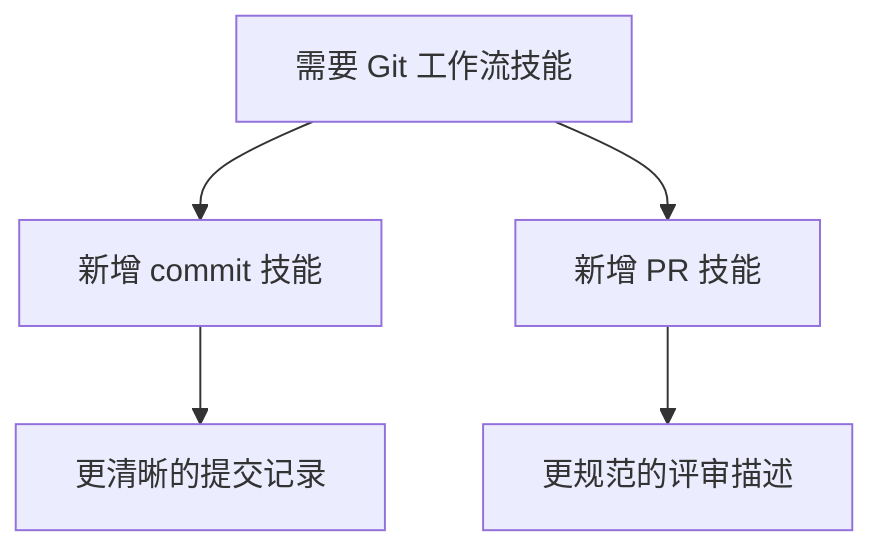

# Create PR Skill

**Purpose**: 帮助 Agent 创建高质量、易于评审和合并的 Pull Request (PR)。默认使用中文编写。

## Input

PR request: `${ARGUMENTS}`

如果请求中未指定基准分支（base branch），请使用仓库默认分支，或在目标不明确时询问用户。

## Workflow



## Instructions

1. **确认 PR 就绪状态**
   - 确保当前分支有已提交的更改。
   - 检查分支是否已推送；若未推送，先推送再创建 PR。
   - 审查 `git status`、提交历史以及相对于基准分支的 diff。

2. **收集仓库上下文**
   - 寻找 PR 模板或贡献指南，并严格遵守。
   - 从 diff 中推断主要的用户侧目标、实现策略和验证步骤。
   - 若有重要信息缺失，请简短询问用户，不要盲目猜测。

3. **编写强有力的 PR 标题**
   - 保持简短且关注成果（Outcome-focused）。
   - 若仓库使用 conventional-commit 规范，请复用该风格。
   - 优先描述结果，而非实现细节。

4. **编写优秀的 PR 描述（默认中文）**
   - **问题与成果**：首先说明要解决的问题和最终达到的效果。
   - **核心改动汇总**：用 3-5 个要点概括最重要的变更。
   - **文件级改动点及原因**：详细说明每个主要文件的改动点，并解释**为什么要这么改**。
   - **影响范围**：描述该改动的整体影响范围（例如：是否影响存量数据、是否有破坏性变更、性能影响等）。
   - **测试与验证**：包含测试命令或手动验证的记录。
   - **风险/备注**：视情况注明迁移细节、发布关注点、截图或后续工作。
   - **Mermaid 概览**：始终包含一个 Mermaid 图表，使变更一眼可见。

5. **Mermaid 规则**
   - 使用简单的 `flowchart TD` 或 `graph TD`。
   - 展示问题、主要改动和验证之间的关系。
   - 标签（Labels）保持简短、可读且稳定。
   - 不要生成没有评审价值的装饰性图表。

6. **创建 PR**
   - 使用 Markdown 构建最终正文。
   - 使用 `gh pr create` 并指定基准分支、标题和正文。
   - 创建后，报告 PR 标题、基准分支和 URL。

## PR Description Template (Chinese)

````markdown
## 摘要
- [用一句话描述改动成果]

## 核心改动
- [改动 1]
- [改动 2]

## 文件级改动点及原因
| 文件路径 | 改动点 | 改动原因 |
| :--- | :--- | :--- |
| `path/to/file1.ts` | 修改了 XXX 逻辑 | 为了解决 YYY 导致的 ZZZ 问题 |
| `path/to/file2.ts` | 新增了 AAA 接口 | 满足 BBB 场景下的需求 |

## 影响范围
- [描述改动对系统其他部分的影响、潜在风险或需要注意的地方]

## 测试验证
- [测试命令或手动验证步骤]

## Mermaid 变更概览


## 风险 / 备注
- [可选：发布注意点、迁移脚本、后续待办等]
````

## Examples

### Example 1: 仅起草描述

Input: `为新技能编写 PR 描述`

Output:
````markdown
## 摘要
- 新增用于提交更改和创建 PR 的可复用技能。

## 核心改动
- 新增 `commit-changes` 技能，支持规范化提交。
- 新增 `create-pr` 技能，支持结构化编写 PR。

## 文件级改动点及原因
| 文件路径 | 改动点 | 改动原因 |
| :--- | :--- | :--- |
| `skills/commit-changes/SKILL.md` | 初始化技能定义 | 提供自动化的规范提交能力 |
| `skills/create-pr/SKILL.md` | 初始化技能定义 | 提供标准化的中文 PR 创建流程 |

## 影响范围
- 优化了开发者的提交流程，不影响存量业务逻辑。

## 测试验证
- 手动审查了新技能的前置元数据和 Markdown 结构。

## Mermaid 变更概览

````

### Example 2: 创建 PR

Input: `创建 PR 到 master 分支`

Output:
```markdown
已创建 PR
- 标题: `feat(skills): add commit and PR workflow skills`
- 基准分支: `master`
- URL: [由 gh 生成]
```

## Guidelines

- 优先考虑评审者的可读性，而非事无巨细。
- 不要捏造测试结果、问题链接或截图。
- 确保 Mermaid 图表与实际 diff 紧密结合。
- 若仓库已有 PR 模板，请将这些部分合并到现有模板中，而非直接替换。
